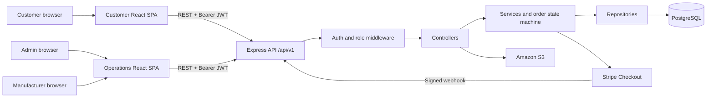

# Hyper Play

Hyper Play is a full-stack sports-commerce platform for customers, administrators, and manufacturers. Customers can browse products, manage a cart, and pay through Stripe Checkout; administrators manage the catalog and fulfilment; manufacturers work assigned orders through a controlled production lifecycle.

## What is included

- Customer storefront with registration, authentication, catalog browsing, cart, checkout, and order history
- Admin portal for products, customers, orders, inventory views, analytics views, and manufacturer assignment
- Manufacturer portal for assigned work, production status updates.
- JWT-based role authorization
- Stripe Checkout and signed webhook processing
- PostgreSQL persistence with inventory reservations and order status history
- Amazon S3 product-image uploads
- Docker images and Compose orchestration for all three applications and PostgreSQL

## Technology

| Layer                 | Technologies                                         |
| --------------------- | ---------------------------------------------------- |
| Customer app          | React 19, React Router, Vite, Tailwind CSS           |
| Operations app        | React 19, React Router, Vite, Tailwind CSS, Radix UI |
| API                   | Node.js 20, Express 5, Joi, JWT, bcrypt              |
| Data and integrations | PostgreSQL 15, TypeORM migrations, Stripe, Amazon S3 |
| Delivery              | Docker, Docker Compose, Nginx, Vercel SPA rewrites   |

## Architecture



## Repository layout

```text
hyper-play/
├── frontend/             Customer React application
├── admin/                Admin and manufacturer React application
├── backend/
│   ├── config/           PostgreSQL connection
│   ├── controllers/      HTTP request and response handling
│   ├── middleware/       Auth, validation, rate limiting, errors
│   ├── repositories/     PostgreSQL queries
│   ├── routes/           Express route definitions
│   ├── services/         Business logic and integrations
│   ├── utils/            S3 uploads and PDF generation
│   └── validations/      Joi request schemas
├── docs/                 Architecture, setup, and API reference
└── docker-compose.yml    Local multi-container stack
```

## Quick start

### Prerequisites

- Node.js 20 or newer and npm
- PostgreSQL 15 or a compatible hosted PostgreSQL database
- Stripe account and Stripe CLI for local webhook testing
- AWS account and S3 bucket for product-image uploads

### 1. Configure the applications

Copy the committed examples to local environment files:

```bash
cp backend/.env.example backend/.env
cp frontend/.env.example frontend/.env
cp admin/.env.example admin/.env
```

Update the placeholders in `backend/.env`. For local npm development, both SPA files should use:

```env
VITE_API_URL=http://localhost:5000/api/v1
```

### 2. Install and run locally

In three terminals:

```bash
cd backend
npm i
npm start
```

```bash
cd frontend
npm i
npm run dev
```

```bash
cd admin
npm i
npm run dev
```

The default local URLs are:

| Service                | URL                            |
| ---------------------- | ------------------------------ |
| Customer app           | `http://localhost:5173`        |
| Admin/manufacturer app | `http://localhost:5174`        |
| API                    | `http://localhost:5000/api/v1` |
| Health check           | `http://localhost:5000/health` |

Protected routes use:

```http
Authorization: Bearer <jwt>
```

Major endpoint groups:

| Group          | Base path              | Purpose                                       |
| -------------- | ---------------------- | --------------------------------------------- |
| Authentication | `/api/v1/auth`         | Customer registration and role-specific login |
| Customer       | `/api/v1/customer`     | Active products, cart, and customer listing   |
| Orders         | `/api/v1/order`        | Checkout and customer order retrieval         |
| Admin          | `/api/v1/admin`        | Products, orders, status, and assignment      |
| Manufacturer   | `/api/v1/manufacturer` | Assigned orders, production status, PDFs      |
| Payments       | `/api/v1/payments`     | Stripe webhook receiver                       |

See the [API reference](docs/API.md) for every route, authorization rules, request bodies, validation, responses, and status transitions.

## Validation

```bash
cd frontend && npm run lint && npm run build
cd admin && npm run lint && npm run build
```

The backend package currently has no automated test suite; its `npm test` script is a placeholder.

## Documentation

- [Setup and operations](docs/SETUP.md)
- [Architecture](docs/ARCHITECTURE.md)
- [API reference](docs/API.md)
