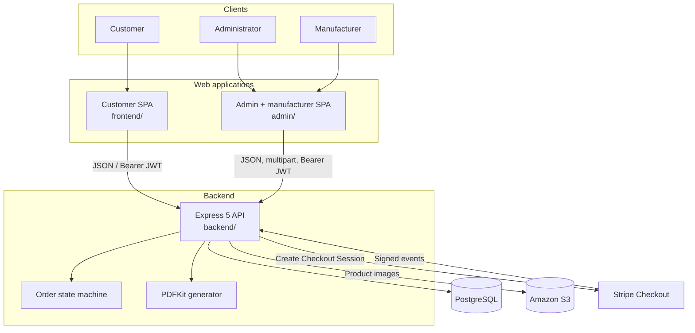
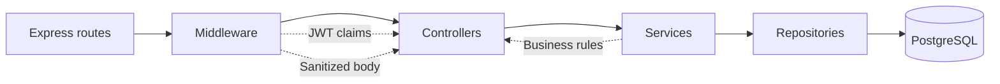
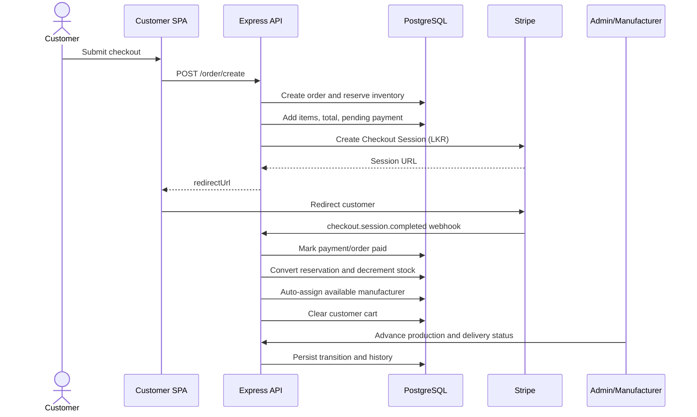
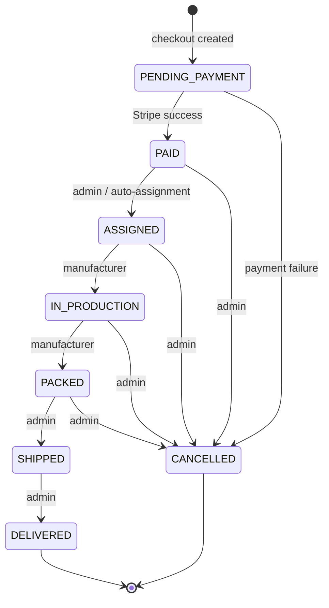
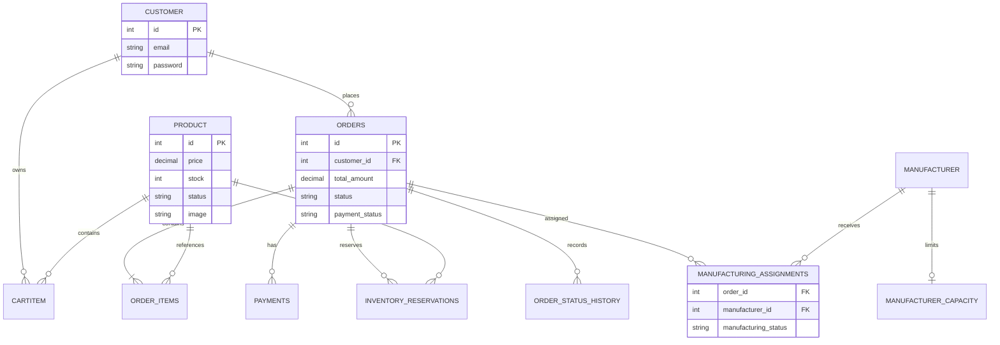

# Architecture

This document describes the architecture implemented in the repository. It distinguishes current behavior from intended role semantics where they differ.

## System context

The customer application and operations application are independent Vite builds. In container deployments Nginx serves each SPA and can proxy `/api/` to the backend service. In local development they call the URL embedded in `VITE_API_URL`.

## Backend layers

| Layer        | Location               | Responsibility                                                                |
| ------------ | ---------------------- | ----------------------------------------------------------------------------- |
| Routes       | `backend/routes`       | HTTP methods, paths, and middleware composition                               |
| Middleware   | `backend/middleware`   | JWT verification, role checks, Joi validation, rate limiting, error responses |
| Controllers  | `backend/controllers`  | HTTP input extraction and response status/envelopes                           |
| Services     | `backend/services`     | Authentication, checkout, fulfilment, state transitions, Stripe events        |
| Repositories | `backend/repositories` | Parameterized SQL and transaction boundaries                                  |
| Utilities    | `backend/utils`        | S3-backed Multer storage and order PDF generation                             |

Authentication tokens contain `id`, `email`, and `role` claims and expire after seven days. Authorization is applied per route through `verifyToken` and `requireRole`.

## Checkout and fulfilment flow

On order creation failure, the service attempts to release inventory and cancel the order. On a failed Stripe payment, the webhook marks payment as failed, releases inventory, and cancels the order.

## Order state machine

Assignment status is synchronized as follows:

| Order status    | Manufacturing status                        |
| --------------- | ------------------------------------------- |
| `ASSIGNED`      | `ASSIGNED`                                  |
| `IN_PRODUCTION` | `IN_PRODUCTION`                             |
| `PACKED`        | `COMPLETED`                                 |
| `CANCELLED`     | `REJECTED` when an active assignment exists |

## Logical data model

The repository does not include schema migrations. This diagram is the logical model inferred from the SQL queries and should be kept in sync when migrations are introduced.

Other queried entities include `admin` and `manufacturer` identity tables. The code also contains disabled design endpoints that reference a `design` table; they are not part of the active API.
